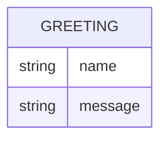

# Domain Model

Greeter has a single, transient concept: the greeting produced for a caller-supplied (or defaulted) name. Nothing is persisted.

- **Greeting** — `name` is the caller-supplied value (or the default "World" when omitted/empty); `message` is the rendered greeting text returned to the caller. Not stored.

